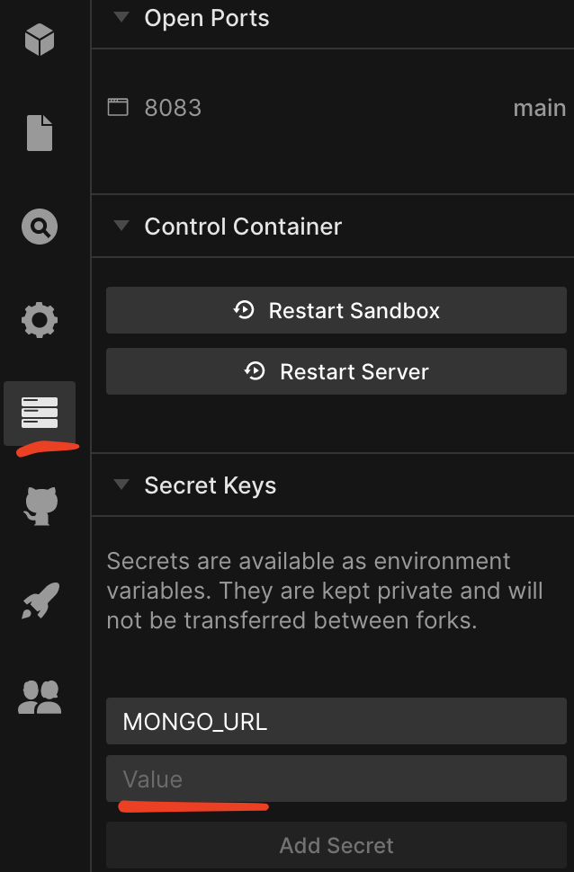
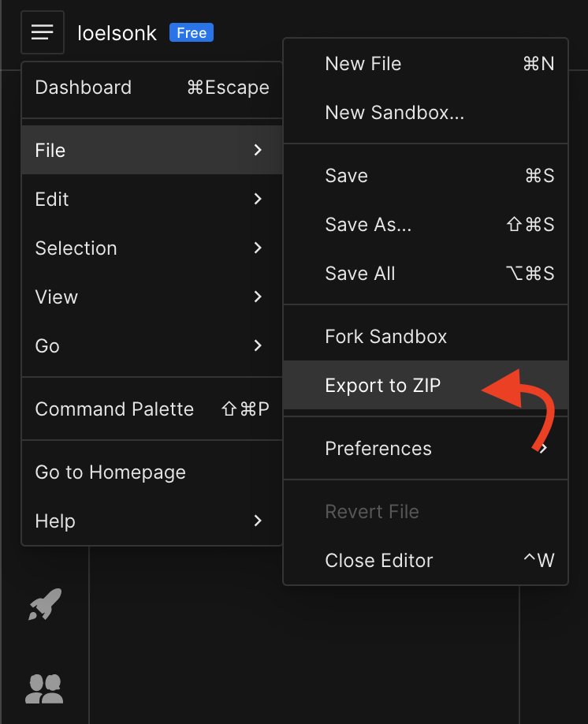

## Konsumowanie API na froncie na przykładzie Swagger/OAS i GraphQL

### Agenda

0. [TLDR](#ad-0-tldr)
1. [Wprowadzenie, skąd pomysł](#ad-1-wprowadzenie-sk%C4%85d-pomys%C5%82)
1. [Krótkie omówienie servera nodejs z którego serwowane jest API](#ad-2-kr%C3%B3tkie-om%C3%B3wienie-servera-nodejs-z-kt%C3%B3rego-serwowane-jest-api)
1. [Generowanie typów TypeScript i http client na podstawie Swagger/OAS API](#ad-3-generowanie-typ%C3%B3w-typescript-i-http-client-na-podstawie-swaggeroas-api)
1. [Codegen Generator dla GraphQL](#ad-3-generowanie-typ%C3%B3w-typescript-i-http-client-na-podstawie-swaggeroas-api)
1. [Przykładowe wykorzystanie w aplikacji reactowej przy użyciu biblioteki React Query, Apollo Client](#ad-4-codegen-generator-dla-graphql)
1. [Jak wspomóc się apkami Postman i Altair](#ad-6-tooling-jak-wspom%C3%B3c-si%C4%99-apkami-postman-i-altair)
1. [Podsumowanie](#podsumowanie)
   
----

### Ad 0. TLDR

- codesandbox backend: https://codesandbox.io/s/tsed-swagger-graphql-092021-g9n41
- codesandbox frontend: https://codesandbox.io/s/gifted-bird-go7vs

### Ad 1. Wprowadzenie, skąd pomysł

Z perspektywy frontendowca
Pod koniec ubiegłego roku jeden z naszych klientów dał nam dosyć krótki deadline na realizację projektu.
Były to mniej więcej niecałe 2 miesiące, które ostatecznie zostały przedłużone do 3. 
Backend nie był przygotowany, w zasadzie nic nie było, a wszystkie zespoły w projekcie pracowały równolegle.
Ustalenia z klientem często się zmieniały, a co za tym idzie kontrakt pomiędzy BE a FE. 
Wiedzieliśmy, że żeby wyrobić się w terminie(gdzie kolejne iteracje trwały nawet 4 dni) będziemy potrzebować sposobu na przyspieszenie developmentu.

Z perspektywy backendowca
Nieotypowane resolvery servera Apollo GraphQL. Typy generujemy ze schemy, która jest źródłem prawdy.


#### Słowniczek

- `NodeJS` - runtime JavaScript
- `TypeScript` - typowany nadzbiór/superset/nadbudówka JS, który kompiluje się do czystego JS
- `OAS` - Openapi Specification, kiedyś znana jako Swagger Specification, Standard dla RESTful Apis
- `Swagger` - Zbiór narzędzi implementujących OAS (Parser, Editor, UI, Inspector, itd.)
- `GraphQL` - GraphQL to w zasadzie query language, specyfikacja języka do implementacji serwerów API GraphQL.
            Przykładowe implementacje: Apollo, Relay, Nexus, Yoga, Prisma.
    - `Introspection` - samo/dokumentujące się API, automatyczna dostępność do docsów, podpowiedzi `control`+`space`, możliwość integracji z IDE
    - `TypeGraphQL` - framework, umożliwia budowanie schemy, resolverów itd. w TypeScript
- `ReactJS` - biblioteka FE do budowania UI
- `MongoDB` - baza danych noSQL (nierelacyjna)
    - `Mongoose` - narzędzie do modelowania baz MongoDB / ODM (Object Data Modeling)
----

### Ad 2. Krótkie omówienie servera nodejs z którego serwowane jest API

- Sandbox https://codesandbox.io/s/tsed-swagger-graphql-092021-g9n41
- Potrzebujesz jedynie instancji bazy danych mongodb, darmową możesz założyć na https://www.mongodb.com/cloud (btw. mlab.com został przejęty przez mongodb.com)
- Server stoi na frameworku TS.ED https://tsed.io
- Server działa całkiem spoko w developmencie. W razie pytań to lojalnie informuję, że nie wykorzystywałem go nigdy produkcyjnie. Wypróbowałem go jedynie przy okazji realizacji tego warszatu.

#### process.env.MONGO_URL
W zakładce `Server Control Panel` ustawiamy zmienną środowiską `process.env.MONGO_URL`, aby wskazywała na connection string naszej bazy.
Connection string powinien wyglądać mniej więcej tak:
`mongodb+srv://<username>:<password>@<cluster-name>.<random-subdomain>.mongodb.net/myFirstDatabase?retryWrites=true&w=majority`



#### Jak pobrać projekt


----

### Ad 3. Generowanie typów TypeScript i http client na podstawie Swagger/OAS API

1. Dodajemy do projektu [swagger-typescript-api](https://github.com/acacode/swagger-typescript-api) 
   jako dev dependency np. 
```
yarn add -D swagger-typescript-api
```

2. Tworzymy plik `swagger-api.js` w roocie projektu o zwartości

```javascript
const path = require('path');
const { generateApi } = require('swagger-typescript-api');

generateApi({
    name: 'api.ts',
    url: '<url swagger schema json>',
    // input:  path.join(__dirname, 'schema.json'), // ewentualnie zamiast url lokalny plik schemy json, yml
    output: path.join(__dirname, 'src'),
    generateClient: true,
}).catch((e) => console.error(e.message));
```
3. W package.json możemy dodać
```json
{
  "scripts": {
    "swagger:types": "node swagger-api.js"
  }
}
```

Za każdym razem kiedy zmieniany jest kontrakt z backendem powinniśmy wygenerować na nowo typy i klienta

----

### Ad 4. Codegen Generator dla GraphQL

GraphQL codegen posłuży nam do wygenerowania
- typów typescript
- na podstawie pliku `operations.graphql` wygenerujemy
    - `codegen-typescript-react-apollo-api.ts` gotowe do użycia otypowane hooki operacji (query/mutation) `@apollo/client`
    - `codegen-typescript-react-query-api.ts` gotowe do użycia otypowane hooki `react-query`
    
1. Dodajemy do projektu [graphql-codegen](https://github.com/dotansimha/graphql-code-generator)
   jako dev dependency 
```
yarn add -D graphql @graphql-codegen/cli @graphql-codegen/typescript @graphql-codegen/typescript-operations @graphql-codegen/typescript-react-apollo @graphql-codegen/typescript-react-query @graphql-codegen/typescript-type-graphql
```

2. Tworzymy plik `codegen.yml` w roocie projektu o zwartości
```yaml
schema: https://g9n41.sse.codesandbox.io/graphql
documents: ./operations.graphql
config:
  fetcher:
    endpoint: https://g9n41.sse.codesandbox.io/graphql
    fetchParams:
      headers:
        Content-Type: application/json
generates:
  ./src/graphql-codegen-react-query-api.ts:
    plugins:
      - typescript
      - typescript-operations
      - typescript-react-query
  ./src/graphql-codegen-apollo-api.ts:
    plugins:
      - typescript
      - typescript-operations
      - typescript-react-apollo
```

3. W package.json możemy dodać
```json
{
  "scripts": {
    "graphql-codegen": "graphql-codegen"
  }
}
```
4. Wykonujemy skrypt, w `./src` dir zostaną dodane 2 nowe pliki
```
yarn graphql-codegen
```

linki:
- https://www.graphql-code-generator.com/ ciekawy playground na głównej stronie
- https://www.graphql-code-generator.com/docs/plugins/index dokumentacja dostępnych pluginów
----

### Ad 5. Przykładowe wykorzystanie w aplikacji reactowej przy użyciu biblioteki React Query, Apollo Client

codesandbox aplikacji frontowej:
https://codesandbox.io/s/gifted-bird-go7vs


linki:
- https://chrome.google.com/webstore/detail/apollo-client-devtools/jdkknkkbebbapilgoeccciglkfbmbnfm/ Apollo Devtools

----

### Ad 6. Tooling. Jak wspomóc się apkami Postman i Altair

#### Postman

Wspomaganie na przykładzie importowania [schema.json](https://g9n41.sse.codesandbox.io/v3/docs/swagger.json) swaggera do postmana

1. Klikamy `Import` z pliku lub linku
1. Profit, w `Collections` otrzymujemy pogrupowane i sparametryzowane endpointy
1. Pozostaje tylko przygotowanie środowiska dla zaimportowanego API i gotowe

Link do webinaru z Tłustego czwartku [APIs 101 with Postman (for Beginners) [ENG]](https://billenniumspzoo.sharepoint.com/sites/HR/LearningAndDevelopment/SitePages/Szkolenia/pl/Akademia-wiedzy.aspx#apis-101-with-postman-%28for-beginners%29
)

#### Altair

Altair to aktualnie najlepszy playground do GraphQL. 
Podobny w użytkowaniu do Postmana, który to do GraphQL nie nadaje się z jednego powodu
- braku automatycznego odświeżania schemy po jej zmianie, nie jest wykorzystywana introspekcja doców.
- schemę musimy w Postmanie kopiować ręcznie, aby mieć namiastkę introspekcji

#### Generatory OAS do GraphQL
Istnieją generatory mapujące OAS na schemę GraphQL - SDL, czy corowy obiekt `GraphQLSchema`

Przy bardziej złożonych schemach OAS nie będziemy w stanie zmapować 1:1
Generator z pewnością może nam pomóc w developmencie, ale nie możemy zakładać, że wykona za nas całą robotę.

Sprawdziłem 3 biblioteki do rzutowania OAS v2 v3
- `swagger-to-graphql` (jedynie OAS v2)
- `swagql`
- `openapi-to-graphql`

i najlepiej radzi sobie `openapi-to-graphql`

----

### Ad. 7. Podsumowanie

#### Wady i zalety Generatorów

*Pros*
- Kontrakt API to źródło prawdy dla aplikacji na froncie
- Poprawne typy
- Uderzamy do właściwych endpointów API
- Używamy prawidłowych parametrów
- Jeśli gdzieś jest błąd to najpewniej na backendzie
- Z łatwością interpretujemy response requestu
- Z łatwością jesteśmy w stanie zweryfikować zmiany, które nastąpiły w API
- [typescript] Błędy w czasie kompilacji kodu, a nie w runtime
- Oszczędność czasu, nie musimy się martwić refactorem, martwym kodem, naprawą błędów, niepoprawnymi typami
- Mamy świadomość, że nasz codebase, a przynajmniej codebase naszego API jest niezawodny :)

*Cons*
- Raczej dla małych teamów 
  - Konieczność przeładowania/ponownej generacji typów i clienta http przy zmianie kontraktu przez backend
- Może być uciążliwe dla dużych zespołów
  - [solution] Paczka z typami i clientem mogłaby być wystawiana zaraz obok nowej wersji backendu (integracja CI/CD)


#### Do poczytania / Linki

- https://react-typescript-cheatsheet.netlify.app
- https://blog.pragmatists.com/generating-a-typescript-api-client-541109422c40
- https://dev.to/wkrueger/integrating-apis-to-a-typescript-frontend-with-openapi-swagger-3521
- https://the-guild.dev/blog/whats-new-in-graphql-codegen-v2
- https://openapi-generator.tech/
- https://tsed.io/


----


